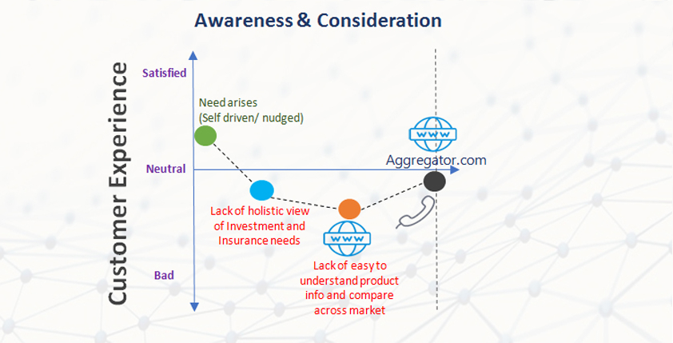
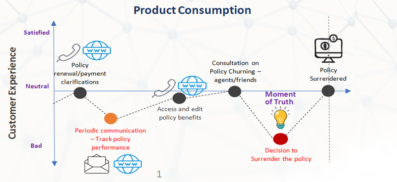

The insurance industry is currently facing a digital-driven and consumer-led
disruption similar to those faced by the retail, banking, media, and
entertainment industries in the past.[1] As a result, customer
experience is increasingly taking the front seat, with customers expecting a
personalized engagement to best utilize the products/services benefits.

Customer retention is a significant problem faced by the Insurance industry
globally. In fact, a global Insurance industry survey1 revealed that over the
past 18 months, an average of 1 in 3 customers terminated or changed their
existing carrier. Poor penetration makes it difficult for Insurers to sustain
fierce competition and meet ever-changing customer expectations, and a lack of
relevant communication further distances companies in the industry from their
customers. Add to this the fact that acquiring new customers costs companies in
the industry approximately 13 times more than what would be required to retain
existing ones and the issue becomes crystal clear: Insurance companies MUST
prioritize the customer experience.

What does it take to retain customers? There are three key mantras that Insurers
need to focus on to solve this crucial business problem:

In this article, we will focus on first mantra—improving customer journey. The
treatment of the customer during her engagement with the insurer at all key
touch points plays a vital role in the customer’s decision to continue with the
existing carrier or switch to another one. The focus should be on making the
entire customer journey, from onboarding to termination, a pleasant one.

In a typical Insurance company, the customer journey comprises 3 major phases.

## Awareness and Consideration Phase

In this phase, customers are determining their own needs and exploring various
products and services options to fulfill their requirements. The major challenge
of this phase is the lack of connection between customer needs and available
Insurance products. Personal engagement allows a company to understand the
customer’s requirements and to recommend the best product matching their needs.
Insurers can utilize advanced analytics to:

- Better understand customer needs and devise products/services recommendations
- Build marketing campaigns based on target customer personas

## Application and Onboarding Phase

Finding the right product at the right price is a big challenge in this phase
and an arduous underwriting process makes things even more complicated and
frustrating for customers. Proper communication with customers can help agents
better understand their needs, which will eventually lead to finding the most
appropriate product at the right price for the customer. Companies globally are
using data science and automation to improve the accuracy and efficiency of the
complex and lengthy underwriting process. Also, efforts should be made to
improve transparency and reduce the complexities involved in onboarding the
customers.

## Product(s) Consumption Phase:

In this phase, the major challenge is the customer’s inability to get a clear
and accurate view of the product performance. Lack of appropriate engagement
with customers in this phase substantially increases the chance of customer
terminating the policy. The key to improving the customer’s experience in this
phase is to initiate strategic engagement with customers and provide a fair and
accurate picture of the product performance.

Advanced analytics can help insurance companies better understand customers,
which in turn can drive effective customer engagements. This approach could
leverage internal customer data along with the external market data to develop
an analytics engine to predict the customer behavior upon utilization of the
product. This would enable the customer engagement team to proactively and
strategically engage with customers who are predicted to demonstrate adverse
behavior.

One of the major shortfalls we have seen in insurance companies is the lack of
sophisticated feedback channels, which makes it difficult to get proper feedback
from all the customers in every phase of engagement. These channels could cover
all stakeholders who are engaging with the customer – the distributor,
underwriter, customer engagement team, and claims settler. These feedback data
points then need to be incorporated in the advanced analytics of customers
behavior to better understand their sentiments about the company. Also, the
feedback could be utilized to devise improvements in the customer experience.

To conclude, the insurance industry is at an inflection point of customers
engagement due to ever-evolving customer expectations and the increasing need of
product innovation. Customer engagement innovation in the Insurance industry
should focus on:

- Personalized engagement based on data driven insights
- Improve digital presence by utilizing chatbots, Mobile Apps, and intuitive
  websites along with periodic updates/touch bases on
  - Product performance
  - Education on product benefits and other related services
  - Personal life events such as birthdays, anniversaries, etc., and
  - In-person interactions with customers through strategically located customer
    centres

The goal for Insurance companies should be to make interaction with customers
more natural, constructive and enabling; less obligative; and less strenuous. In
the wake of a new generation of customers in the developing and developed
markets, it is imperative for Insurance companies to not only embrace the
technology but also to increase the level of empathy for their customers.

---

1. EY Global Consumer Insurance survey 2014
