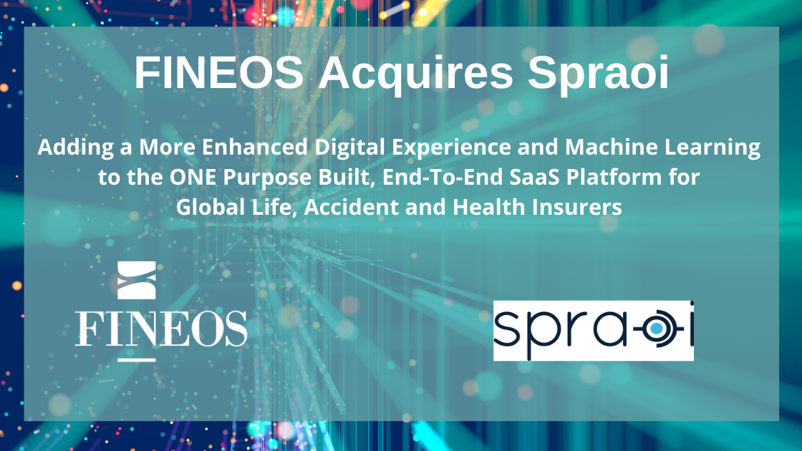

&nbsp;

Atlanta, GA, May 5, 2021 –
[FINEOS Corporation (ASX:FCL)](https://www.fineos.com/): , the global market
leader in core systems for life, accident and health insurance, has entered into
an agreement to acquire Spraoi, a leading provider of machine learning
capabilities for the Group Life and Employee Benefits industry. The union will
enhance [FINEOS Engage](https://www.fineos.com/platform/engage/) and
[FINEOS Insight](https://www.fineos.com/platform/insight/) with additional
digital smart-portal options, industry specific operational and analytical
models, and machine learning capabilities across the
[FINEOS Platform](https://www.fineos.com/platform/).

~~~~
[Michael Kelly](https://www.linkedin.com/in/michael-kelly-4a23a3/), CEO of
FINEOS, said: “We’re very happy to welcome the Spraoi team and their clients to
FINEOS, and look forward to adding their advanced digital and machine learning
capabilities to the FINEOS Platform for the benefit of all of our clients. This
acquisition will greatly enhance the Digital and Data capabilities of FINEOS
Engage and FINEOS Insight, to complement the power of our FINEOS AdminSuite,
making the FINEOS Platform the only purpose-built Employee Benefits platform,
from quote to claim with advanced machine learning capabilities.”

“The North American employee benefits industry is undergoing tremendous change,
which is continually accelerating due to the competitive and regulatory
environment, as well as the constant advancement of technology capabilities,”
adds Kelly. “Spraoi is an innovative InsurTech in the Employee Benefits space
whose leaders have a strong background in the Life, Accident and Health
industry, as well as deep expertise in core systems and machine learning. That
combination makes Spraoi a natural addition to the FINEOS team as we continually
improve the FINEOS Platform to meet the needs of our clients.”

~~~~
[Nancy Casbarro](https://novarica.com/team/), Vice President Research &
Consulting, [Novarica](https://novarica.com/) said, “Applying machine learning
in the insurance industry can unlock the power of data for carriers to enhance
the customer experience, as well as improve business outcomes across the entire
lifecycle from case set-up to claims.”

~~~~
[Karan Mishra](https://www.linkedin.com/in/karan-mishra-spraoi/), co-founder of
Spraoi said, “Spraoi’s technology offering, and services have allowed our
clients to successfully optimize outcomes and see measurable ROI. Our deep
machine learning, data and customer experience capabilities coupled with the
robust FINEOS Platform enables clients to have a one-of-a-kind, pre-integrated
platform to get the most out of their technology investments.”

Spraoi is an insurance technology solutions provider combining ‘Big 4’ insurance
consulting experience with Silicon Valley technology acumen and offshore
capability and scale in India. Its focus is on assisting carrier clients with
the two most pressing needs confronting them today: how to leverage their data
to optimize outcomes using the patent pending Spraoi platform and; how to better
engage customers throughout the lifecycle using their customer engagement
infrastructure.

Spraoi has also created an innovation framework that provides accountability
from concept through execution, eliminating technology as the impediment to
progress.

This acquisition will enable FINEOS to make the best use of machine learning
across the three pillars of the FINEOS Platform: Core, Digital and Data.
Spraoi’s machine learning capabilities and service framework will increase
digital service reach, reduce customer service friction, and provide much
greater insight into the carrier/customer dynamic across the entire customer
lifecycle, making the [FINEOS Platform](https://www.fineos.com/platform/) an
even more attractive offering to the Employee Benefits and Life assurance
industry.

The transaction is subject to customary closing conditions and is expected to
complete quickly. As FINEOS and Spraoi integrate the business over the coming
months, the priority will be to continue to operate on a business as usual basis
in order to meet customer needs.

## About FINEOS Corporation

FINEOS is a leading provider of core systems for life, accident and health
insurers globally with 7 of the 10 largest group life and health carriers in the
US as well as 6 of the largest life insurers in Australia. With employees and
offices throughout the world, FINEOS continues to scale rapidly, working with
innovative progressive insurers in North America, Europe, and Asia Pacific. The
[FINEOS Platform](https://cts.businesswire.com/ct/CT?id=smartlink&url=https%3A%2F%2Fwww.fineos.com%2Fplatform%2F&esheet=52407092&newsitemid=20210406005619&lan=en-US&anchor=FINEOS+Platform&index=10&md5=662ae6768cea5a19df0844b1e839a2d5)
provides core administration capabilities including integrated disability and
absence management (IDAM), billing, claims, payments, policy administration,
provider management and new business and underwriting; all of which are
configurable to operate independently or as
[FINEOS AdminSuite](https://cts.businesswire.com/ct/CT?id=smartlink&url=https%3A%2F%2Fwww.fineos.com%2Fadminsuite%2F&esheet=52407092&newsitemid=20210406005619&lan=en-US&anchor=FINEOS+AdminSuite&index=11&md5=21fd66370f84b77fc8f2e63e6ae453b3)
the leading Employee Benefits end-to-end core administration suite.

## About Spraoi

Spraoi is a Pennsylvania limited liability company. Spraoi is the provider of
machine learning platform and solutions to solve the challenges our insurance
clients face as they seek to gain greater insight into their data. Visit
[www.spraoi.ai](https://spraoi.ai/)

For more information, visit [www.FINEOS.com](https://www.fineos.com/).
